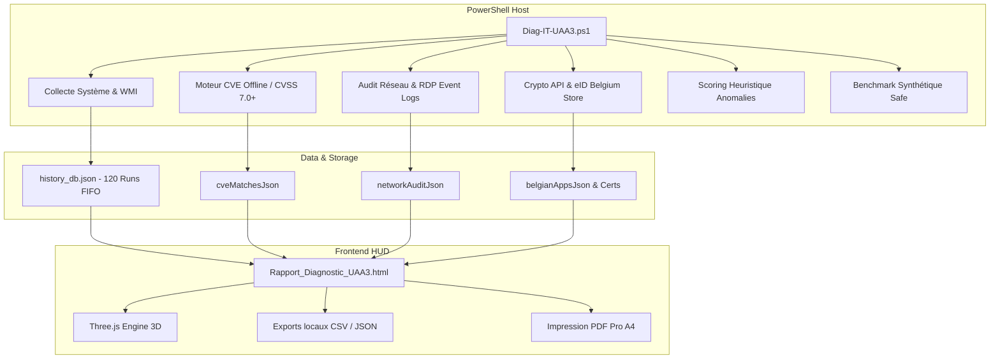

# 📚 ARCHITECTURE TECHNIQUE — DIAG-IT-UAA3 SUITE ENTERPRISE

Ce document détaille l'architecture modulaire, les schémas de données, les mécanismes de sécurité et la chaîne de traitement de la suite de diagnostic et d'audit IT **Diag-IT-UAA3**.

---

## 🏛️ 1. Vue d'Ensemble de l'Architecture

La solution fonctionne selon un modèle **monolithique autonome à zéro dépendance binaire** :
- **Moteur d'Audit & Collecte (PowerShell 5.1 / 7+)** : Sonde directement les API Windows, WMI/CIM, Event Logs, Windows Filtering Platform (WFP), Crypto API et registres sans requérir d'agent tiers.
- **Base Locale d'Historique (JSON FIFO)** : Enregistrement rotatif structuré dans `$env:LOCALAPPDATA\DiagIT\history_db.json` (120 runs max).
- **Rendu Visuel & Cockpit Interactif (HTML5 / Three.js)** : Vérifie le SHA-256 du runtime Three.js r128 conservé dans `vendor/three/`, puis l'injecte dans un fichier HTML autonome. Le rapport n'a aucune dépendance CDN et fonctionne en environnement réseau fermé.

---

## 📦 2. Description Détaillée des 10 Modules

### Module 1 : Health Check & Historique Temporel
* **Schéma de données** : Enregistre `Timestamp`, `DateLabel`, `HealthScore` (0-100), `FreeDiskGB`, `OkCount`, `WarnCount`, `ErrCount`, `CveCount`, `CpuScore`.
* **Algorithme de rotation** : Conserve glissant les 120 derniers scans pour un poids de fichier raisonnable.
* **Score Prédictif** : Détecte les anomalies chroniques et évalue la probabilité de panne dans les 90 jours.

### Module 2 : Scanner de Vulnérabilités Logicielles (CVE)
* **Base offline embarquée** : Cible les logiciels à fort déploiement (Chrome, Firefox, Edge, WinRAR, 7-Zip, PuTTY, VLC, Git, Node.js, Python).
* **Seuil de criticité** : CVSS $\ge$ 7.0 (Haute & Critique) pour concentrer l'action sur les risques exploitables.

### Module 3 : Audit Réseau Avancé & RDP
* **Partages SMB** : Détection des partages locaux hors partages administratifs cachés (`ADMIN$`, `C$`).
* **Matrice de Latence** : Test ICMP/TCP vers la passerelle par défaut, Cloudflare (1.1.1.1), Google (8.8.8.8) et Microsoft 365.
* **Sécurité RDP** : Extraction des connexions distantes réussies (`Event ID 4624 Type 10`) et tentatives d'intrusion (`Event ID 4625`).

### Module 4 : Analyse Disque Intelligente & TreeMap
* **Mesure des zones volumineuses** : `%TEMP%`, `C:\Windows\Temp`, `SoftwareDistribution\Download`, `CrashDumps`.
* **Nettoyage 1-Clic** : Commande PowerShell préconfigurée pour récupérer immédiatement plusieurs gigaoctets.

### Module 5 : Catalogue national Logiciels Métiers, E-Banking, Fiscalité & eID
* **Catalogue adaptatif** : liste blanche `BE`, `FR`, `UK/US`, `DE`, `ES`, `IT`, `PT`, avec sélection indépendante de la langue d'affichage.
* **Belgique — services officiels** : Belgium e-ID Middleware, CSAM, MyMinfin, Intervat, Biztax et e-Deposit/Centrale des bilans (BNB), chacun relié à sa source institutionnelle.
* **Belgique — références éditeur** : Winbooks, Sage BOB, Isabel 6, Silverfin, Accon, SuperFisc et Octopus. Ces fiches sont des références de l'écosystème professionnel, pas des agréments administratifs.
* **Détection locale** : statut installé/non installé et version sont calculés à partir de l'inventaire du poste ; la fiche catalogue n'est jamais utilisée comme preuve d'installation.
* **Magasin de Certificats Windows** : Scanne `Cert:\CurrentUser\My` et `Cert:\LocalMachine\My` pour identifier les certificats d'authentification et de signature avec alerte d'expiration sous 30 jours.

### Module 6 : Exports locaux & compatibilité RMM
* **Formats supportés** : JSON universel (SIEM/Datto/ConnectWise), CSV d'inventaire technique.
* **Conditions d'alerte** : Déclenchement de tickets d'intervention automatisés en cas d'erreurs critiques.

### Module 7 : Benchmark Réel Non-Invasif
* **Calcul Mathématique Mono-Thread (< 1.5s)** : Calcul de 12 000 nombres premiers pour étalonner la puissance réelle du processeur sans générer d'échauffement thermique.
* **Télémétrie SMART** : Extraction de l'usure résiduelle (`Wear %`), des heures d'activité (`PowerOnHours`) et des erreurs de lecture.

### Module 8 : Audit Sécurité Utilisateurs & Persistance
* **Comptes locaux** : Statut d'activation, politique d'expiration de mot de passe et date de dernière session.
* **Privilèges** : Liste nominative des membres du groupe `Administrateurs`.

### Module 9 : Export Multiformat & Portail Client
* **Feuille de style `@media print` A4** : Structure le rapport pour une impression PDF immédiate et soignée destinée au client final.

### Module 10 : Détection d'Anomalies Heuristiques & Whitelist
* **Modèle de Scoring Heuristique** :
  * Emplacement non approuvé (`%TEMP%`, `Public`) : `+4 pts`
  * Absence de signature numérique valide : `+3 pts`
  * Exécution à la racine du lecteur : `+3 pts`
  * *Alerte active uniquement si Score Total $\ge$ 6*.
* **Whitelist intégrée** : Exclusion automatique des installateurs et outils certifiés (`msiexec`, `vcredist`, `dotnet`, `powershell`, `node`, `code`, `winget`, `update`).

### Module 11 : Configuration Externe (`modules_config.json`)
* **Chargeur strict** : `Diag-ConfigLoader.ps1` lit `modules_config.json` depuis `$PSScriptRoot` via `ConvertFrom-Json` (lecture stricte), vérifie la présence des sections/propriétés requises (`settings.history`, `settings.belgian_ecosystem`, `settings.cve_scanner`) et **lève une erreur explicite** si le fichier est absent ou invalide.
* **Repli sûr** : En cas d'échec (fichier manquant, JSON cassé, section absente), le moteur retombe sur les valeurs historiques par défaut (`max_runs_retention=120`, `score_baseline_threshold=75`, `cvss_min_severity=7.0`, `cert_alert_days=30`, `cert_critical_alert_days=7`). Aucune erreur silencieuse.
* **Paramètres pilotés (correspondance exacte, code existant uniquement)** :
  * `settings.history.max_runs_retention` → troncature FIFO de l'historique.
  * `settings.history.score_baseline_threshold` → seuil de prédiction de santé.
  * `settings.cve_scanner.cvss_min_severity` → filtre minimal de sévérité CVE.
  * `settings.belgian_ecosystem.cert_alert_days` / `cert_critical_alert_days` → seuils d'alerte expiration eID.
* **Hors périmètre (clés présentes mais non câblées)** : `trusted_paths`, `trusted_processes`, `ignore_domains`, `alert_threshold_score`, `performance_benchmark`, `rmm_integrations.*` — réservés aux chantiers ultérieurs. Le webhook est désactivé par défaut.

---

## 🔧 2.1 Correction Extraction Passerelle IPv4
* **Symptôme** : `Test-NetConnection -ComputerName 1` et affichage « Passerelle : 1 » au lieu de l'IP complète.
* **Cause** : `$gwList = (...).Address.IPAddressToString` produisait une chaîne scalaire quand une seule passerelle existait ; `$gwList[0]` renvoyait alors le **premier caractère**.
* **Correctif** : L'extraction utilise `@($ipProps.GatewayAddresses | Where-Object {...} | ForEach-Object {...})` dans le scope du moteur — l'`@()` force un tableau même à un seul élément, évitant l'unrolling PowerShell. Gère zéro / une / plusieurs passerelles, et conserve `$null` quand aucune passerelle n'existe.

---

## 🔒 3. Sécurité & Droits d'Exécution
* **Élévation UAC** : Redémarrage automatique avec invite d'élévation UAC si le script n'est pas exécuté en Administrateur.
* **Intégrité des Données** : Aucune donnée télémétrique n'est transmise vers des serveurs tiers ; tous les calculs sont strictement locaux au poste.
